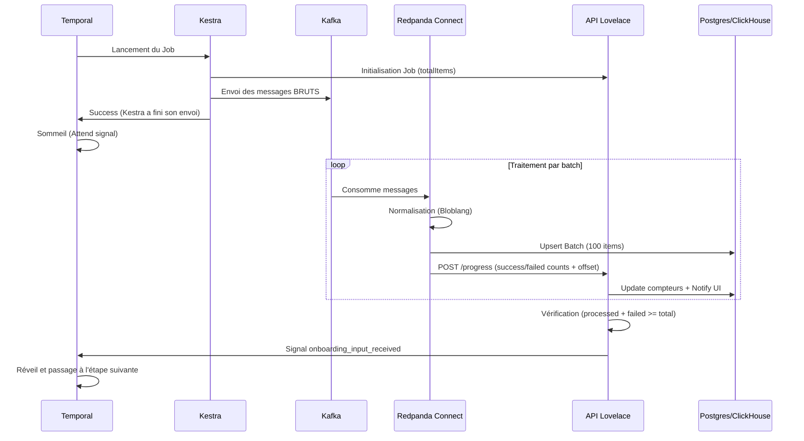

Ce document récapitule le flux de données asynchrone validé pour Lovelace, permettant de gérer de gros volumes (ex: 6000 membres Discord) sans saturer l'infrastructure.

## Le Flow Complet

## 1. Initialisation (Kestra)
- Le script Python calcule le total d'éléments à envoyer.
- Appel à l'API pour fixer le `totalItems` dans `game_onboarding_progress`.
- Envoi des messages bruts dans Kafka.

## 2. Traitement & Normalisation (Connect)
- **Mapping** : Conversion du brut plateforme vers le schéma Lovelace via Bloblang.
- **Batching** : Envoi vers Postgres par lots de 100 pour préserver le pool de connexions.
- **Fiabilité** : En cas d'erreur sur un lot, Connect l'éclate pour traiter les messages un par un (isolement des erreurs).
- **DLQ** : Les messages en échec critique sont envoyés dans une Dead Letter Queue.

## 3. Suivi & Signal (API)
- **Route `/progress`** : Reçoit les incréments de succès/échec de Connect.
- **Idempotence** : Utilise l'offset Kafka pour éviter les doubles comptages en cas de reboot de Connect.
- **Signal** : L'API est le seul juge de la complétion. Elle envoie le signal `onboarding_input_received` à Temporal quand le compte est bon.

## 4. Unification des Signaux
Tous les workflows (Kestra, Formulaires, Connect) utilisent le signal unique : `onboarding_input_received`.