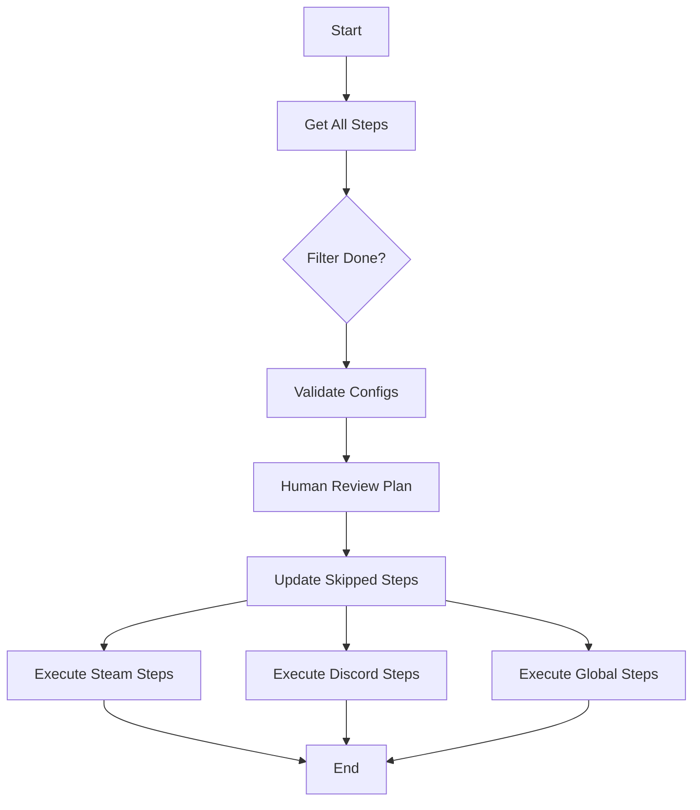

L'onboarding d'un jeu est orchestré par le workflow Temporal `MainOnboardingWorkflow`. Il suit une logique séquentielle précise pour garantir que chaque étape est validée et exécutée correctement.

## Cycle de Vie

### 1. Initialisation
Lorsqu'un utilisateur clique sur "Lancer l'Onboarding" dans l'Admin UI :
1.  L'API appelle Temporal (`POST /admin/onboarding/:gameId/start`).
2.  Le workflow `MainOnboardingWorkflow` démarre avec l'ID du jeu.

### 2. Récupération du Plan (`Get Steps`)
Le workflow interroge la base de données pour récupérer la liste de **toutes les étapes disponibles** pour ce jeu.
*   Il inclut les étapes globales (sans plateforme).
*   Il inclut les étapes liées aux plateformes actives du jeu (ex: seulement Steam si Discord n'est pas connecté).

### 3. Filtrage Delta
Le workflow compare le plan théorique avec l'état actuel de l'avancement (`game_onboarding_progress`).
*   Il ignore les étapes déjà **Completed** ou **Skipped**.
*   Il ne garde que ce qui reste à faire.

### 4. Validation des Configurations
Avant de lancer quoi que ce soit, le workflow vérifie que toutes les plateformes impliquées ont leurs configurations minimales (API Key, Guild ID, etc.).
*   Si une config manque, il se met en pause et demande à l'admin de compléter via un formulaire (`CONFIG_FORM`).

### 5. Revue du Plan (`REVIEW_PLAN`)
C'est le moment "Go / No-Go".
*   Le workflow envoie une demande à l'interface Admin.
*   L'utilisateur voit la liste des étapes qui vont être lancées.
*   Il peut décocher certaines étapes pour les sauter ("Skip").
*   Une fois validé, le workflow reprend.

### 6. Exécution (Parallélisme par Plateforme)
C'est le cœur du réacteur.
*   Les étapes sont groupées par plateforme.
*   Chaque groupe de plateforme est exécuté **en parallèle**.
*   À l'intérieur d'un groupe, les étapes sont exécutées **séquentiellement** (selon l'ordre défini).

### 7. Fin
Une fois que tout est fini, le workflow s'arrête et le statut global passe à 100%.

---

## Diagramme Simplifié

